# Hello there; welcome 👋🏾

[![AltSchool Badge](https://img.shields.io/badge/-Engineering-6773E5?style=for-the-badge&logo=data:image/png;base64,iVBORw0KGgoAAAANSUhEUgAAAIcAAACHCAYAAAA850oKAAAACXBIWXMAACE4AAAhOAFFljFgAAAAAXNSR0IArs4c6QAAAARnQU1BAACxjwv8YQUAAAcmSURBVHgB7d3/kZtGFAfwbzL5P0oF2VRwlwq8qcBKBUcqsFyBSAW5VGBcgS8ViFRwdgW3qeDcgaM3wBy3egu7sBLY9/3MMD6h5QnBg/0ByAARERERERERERERERERERERERERERERERERERERERERERERERFdwHc4DxtR5uNx+hxRbnOcriOWjS1HC7LH6UvEVETGK5RlzYxyFOl75Fco894r816BVu0cyaHt9Fucnt63aKoCWqncyWFxeir/F03d/483X2sj0IrkTo5CmVd5//bdgFYrd3JoVUrd/qv1HFi1rNgPyEeqCOPNkyrFtX9LYkjV0j9bdFVLjWlk+V3795Xy/g5PCVn11oUuTBqdY91Vq5R5NxK3QLiLahDXbf6CuLEX6slZrQxVKR1WLV+RXMlhoI9OOm9eV7X0sdeyUrmSY6vMex8oWynzpvZaHJpLAH+gScb6OP19nH5p5/enGrSIA+KHruVM8eiVfUS4aikiY/ttnj1ocQanO+9+ZJkK8Q3GAtOvrbAtM0OOasUq896PLFMp86ZWLUOYHDPkGOfQdqqc0t8gjbRb3oKX2FdjbnIY6GeODdKP2rkDYpTZ3GrFIq8taDXmJkfudsI52h000ZxqRaoB681zx+k3xJPu52slZg1a3Jzk0KqAGmkXt/zk6OLWuIyXOHTvcIHte4f5F7dCA2J9BaaPc4xVUw7xF+6+lekdIs1pc7zyXjukZ2ToWotFOq0LXB2nh3bi9ZtEU5NDOx3XmKYKxE9VQ08Q004cEEs0Jzl8Y6OiIdpl/BukkxhvQdlMTQ6/Eekw/cyRs2qpjtPv4B1fWUx94s0o8xym00ZUP7eT9p5DeswuXp/By6NtByIiIiIiIqJvwbl+2ecaT9cyZKxB+tUO/KWdr0rO5LBo7huVf4euY9RohtorXNbBe73EOixBrsKa3mt5frnEhWzaFUi9dPyAy45Q+p9f4mVwWOCSvZDEkGdUCqQz7bK8lL5Sc+8+lzu5jDJf2hWf0LQx0Ja5UspKcn04Tr+CbZFvioFeXUjChNocZWCZEufHaiWxWpmjxLQNXkBvf5wbkyMxOeZUK0aZd4dxFZqbeawXSyY3suw1nveGpCrqnq6fy7bxN72YqVVd92BWF0c4pN947ce0eN42+wj9Jy5WowIm32C8Q7PB+pMZKG+hP8nfP/OMPX4ZOnN07R4t5h5xNm3Zx4F1lPVPaXwbNNt4LKYZieOwQLWyg76yue/V3CNP9ziUHB8w727t6/ZzY9dxj3FbDCdFSkyX+H2ysAjvoAJ5uqh7xG+g/udrCaolRxEZcxdYP4O0ndhNfyFsOyHeUII4LJAc4oDhFZYNJ0embFyLNEUgZo1mx5bt31qZgxJPS477NkbRTjLvIfA9/ITbDJSteuv4gPiEMwMxb9t4twMxrRLTYaHkMEg/ciRZiojY2gYolXI7xG0o//0qEM8EPtu/434P/axllJgl4hKuUsrdQz8Tlog7KBwWSg5hkFbnjm1IUSjlh75UqZS/9cpoSRqiJVzplXlI+D7A+E9xbpC2jcQB4weFw4LJ0ZENOiVJbpRYd0q5oTZM1/10van2yqQkm8FwctjEeN06Pg4so7U1ipGYFuMHhcMKkqNj0SSK7ODYKsd6Me5xegTNNbSzU8trZ5aYBvgB4e9VKjFNREznLXM38n50cpzjv9So0WSvHAk/obluIj8FKZfIXWCZvffa39D/YV20NsBHjPvkvTaBv8VnxA1y+Z97hUzOkRw+WfkKzSlSfh/0T6WMxcu4Opsy4hpbNnUUN9rU4XOD0/qwRtwwdonmyPNHNC3CR9+PWBdth2wwvqOuI+L048X4OSFmkqnJ0Q0X+/NqxJFyb5TlO1KN9L+0wbpoO0B2fI1h/o7sVzNyYNz0XnfXVGoMO1sVPLVaCT0Zn2vo3G9UdRsqRGvp1zifO2XefmQZC/334bW/O68xrMDpNr/DCkij098hHyKWC40s2l4ZC73Pv0mIV3jlcvZWxAFx3fKhdfST5R7jPbmOCcQ0XjmHBbqyBnq3VFbYBpaR+feBZXyHQLnrifFyJ4eF/v33eL6DLPSdqO2kIiKmJNo2IaaLKHMWO+hfRiYZ4zi0KyNnlIeBslsl9jXC4ySPGB5DKZR4uZND3GL4+4fek21hAp97yBzTYaHkECXCKxwz7QZiFxPilYFY50gOUSFt/WQHj4323ifGfEA42RwWTA5RIH3oXMrbiNgmMrZs9O1AnHMlBxB/gNSI73ndZorpMDE5cj7UZPA0dB4apZMejnTfSqT3Jgo0O/8Vnt8mKPGkhV5huI9fea/vMNyyTy1v2nW0eP5Li9K1rNt4NdIYPN3ucOXF7NanHokhSdZvyNeIfJgrZ3L0dfdSbnD6OCQRERERERERERERERERERERERERERERERERERERERERERERERERERERncX/Z96oxRsCt/4AAAAASUVORK5CYII=&logoColor=white&link=https://altschoolafrica.com/schools/engineering)](https://altschoolafrica.com/schools/engineering)   

A Fullstack JavaScript/TypeScript(Node and React) engineer with a sound technical background with 7 years+ worth of experience working at small to mid-sized startups. I am driven by my love for building software products and possess good leadership experience leading engineering teams. Have worked with cutting-edge web technologies like React and Vue to build software products that are tested using Vitest and Playwright in a Test Driven Development approach using Agile methodologies. Have consistently worked with TypeScript, Nodejs, React, Gatsbyjs and Nextjs in a production environment. I write Python conveniently.

# 5 Recent Blog Posts from my [blog](https://oluwasetemi.dev)
<!-- blog start -->
[Object Properties Configuration in JavaScript](https://oluwasetemi.dev/blog/object-properties-configuration-in-java-script/) - 2024-08-09

[Introduction To Data Structures:Implementing LinkedList](https://oluwasetemi.dev/blog/introduction-to-data-structures-implementing-linked-list/) - 2024-08-07

[Building an e-commerce app continued(authentication) part 3](https://oluwasetemi.dev/blog/building-an-e-commerce-app-continued-authentication-part-3/) - 2024-08-05

[Scheduling with Timeout and Interval, Decorators, forwarding, call/apply and function binding](https://oluwasetemi.dev/blog/scheduling-with-timeout-and-interval-decorators-forwarding-call-apply-and-function-binding/) - 2024-08-04

[2021 in Review](https://oluwasetemi.dev/blog/2021-in-review/) - 2021-12-28

[Developer Experience with Command Line Interface(CLI) Tools](https://oluwasetemi.dev/blog/developer-experience-with-command-line-interface-cli-tools/) - 2021-11-16
<!-- blog end -->

**Here's a quick summary about me**:

- 😊 Pronouns: He/him
- 👷 Currently a Fullstack Engineer at [Fluna](https://fluna.co)
- 💡 Fun fact: I'm currently part-time tutor at AltSchool Africa [School of Software Engineering](https://altschoolafrica.com/schools/engineering).
- 👨🏻‍💻 Streaming about JavaScript on Fridays and Reactjs on Saturdays 3pm EST or 9pm WAT on [youtube](https://youtube.com/@setemiojo), [twitch](https://twitch.tv/setemiojo) and [linkedin](https://www.linkedin.com/in/setemiojo/)
- 🖋️ I write about my experience as an Engineer on [Oluwasetemi](https://oluwasetemi.dev)
- 🌱 I’m currently learning TypeScript, JavaScript, Reactjs, and Python.
- 😊 I’m looking for opportunities to help contribute to open source projects.
- 💼 Job interests: Software Engineer, Frontend Engineer, Backend Engineer or Full Stack Engineer (Senior level).
- 📫 You can [view my resume](https://cv.oluwasetemi.dev/) and contact me by emailing setemiojo@gmail.com.

---

|  |  |  |
| ------------- | ------------- | ------------- |
